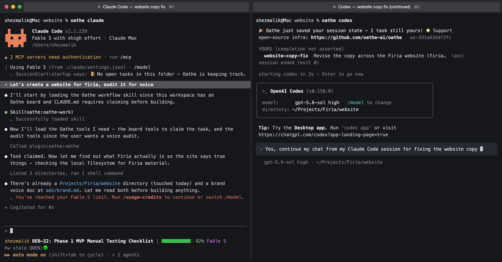

# oathe

**Auto save across your harnesses.**

[](https://github.com/oathe-ai/oathe/actions/workflows/ci.yml) [](LICENSE) [](https://discord.gg/sjrdWEj4W8)



You're building the sweetest thing in Claude Code when it hits a usage limit. What if you could open Codex and it picks up the same task checkpointed, what's done, what's left, and a test that decides whether it's finished. No copy and paste, no re-explaining, and the new agent doesn't have to take the old agent's word for anything because **models are getting too good at being wrong AND confident.**

That's oathe. 

Below is exactly how much of it works today, because a reliability project that overstates its own status would be a joke.

## Quickstart

You need Node ≥ 22 and a running Postgres. Every command below is real and exercised by the
test suite and a clean-container proof.

```bash
npm install -g @oathe/oathe@latest

cd your-project
oathe init          # local substrate up (createdb + schema), both installed harnesses onboarded
oathe claude        # a normal interactive session — the board shows, nothing auto-resumes
```

Ctrl-C anytime. Open `oathe codex` in the same folder — same board, same claims, other harness.

What Oathe reads, stores, and sends: [docs/PRIVACY.md](docs/PRIVACY.md). The full
technical reference: [docs/PACKAGE.md](docs/PACKAGE.md).

```bash
oathe claim <task> "what done means"        # you can also be more specific
oathe codex
```
## What gets saved

most harnesses save transcripts today. 
when projects are getting bigger and bigger this is insufficient.
long-running systems are juggling so many tasks that the model loses attention.
oathe goes up a layer of abstraction:

| Saved | Why it matters |
| --- | --- |
| The task and who owns it | The next agent continues *assigned work*, not the last sentence someone typed |
| Progress and evidence | no grep, proper evidence and agent trajectory analysis to **make sure agents are DOING what they SAY they're doing**|
| Side-effect receipts | critical actions get deduplicated etc. (A deploy, payment etc.) that already happened doesn't happen again on retry |
| Definition of done | established before agent work starts, so it can't quietly drift |
| workspace checkpoint | Branch, commit, and work-in-progress bytes survive your session |

Model context is a cache. Attention is everything.

If a session dies, oathe compiles a context bundle for the next attempt from saved state. It never pretends to recover an agent's hidden reasoning.

## How a handoff works

```text
task claimed
  → attempt 1 (Claude Code) works in a scoped workspace
  → checkpoint · checkpoint · checkpoint
  → attempt 1 dies (crash, kill, rate limit, closed laptop)
  → task survives, still owned
  → attempt 2 (Codex) gets a compiled bundle + a checkpoint
  → attempt 2 inspects the diff and reruns the test before trusting anything
  → work completes; the agent files a completion statement + evidence report.
  → a checker that didn't write any code/take actions verifies the agent did exactly what it states
  → only then is the task settled
```

Two rules carry most of the weight:

1. **tasks outlive agent processes.** Death of an executing agent just creates a new attempt. tasks are durable.
2. **No agent grades its own homework.** "Done" is a claim; verification by a non-author is what closes work.

## What Oathe is not

- **Not a harness.** Claude Code, Codex, OpenClaw and friends keep their own prompts, tools, subagents, and UX. Oathe sits underneath.
- **Not a model router.** Routers pick where a turn runs. Oathe preserves what work exists, what already happened, and what would finish it.
- **Not transcript sync.** No copying hidden state between vendors.
- **Not a sandbox.** Oathe bounds and attributes attempt processes; compose it with your harness's sandbox or VM isolation for filesystem security.
- **Not a memory product.** Transcripts are evidence, never the source of truth.

## Status

Honest labels, kept current in [ROADMAP.md](ROADMAP.md):

- **Working:** durable tasks and attempts, death-and-recovery with a freshly compiled briefing, non-author verification, effect receipts (partial), cross harness handoff.
- **Building:** workspace checkpoints, teammate handoff, the reliability benchmark.
- **Planned:** automatic pickup of interrupted work, cloud continuation, third-party benchmarking.

Known limitations are disclosed in the roadmap, including the ones that are semi-embarrassing.

## Under the hood

A small runtime plus a Postgres schema that carries the invariants. The database is deliberately "load-bearing": the rules that keep work safe (one current attempt per task, receipts before effects, verification before settlement) are enforced where no caller can route around them. Harness adapters are thin; our substrate is strict.

## CLI and MCP

Claim work in-session through the `oathe_*` tools (or from the terminal):

```bash
oathe claim fix-login "users can sign in again"
oathe note  fix-login "found the stale token check"
oathe done  fix-login "guard rewritten, test added" src/auth.test.js
oathe verify fix-login   # a NON-author engine judges it from your recorded session traces
oathe ls                 # the board; `oathe uninstall` removes exactly what init recorded
```

## Contributing

Start with [CONTRIBUTING.md](CONTRIBUTING.md). Substantial changes begin with a design issue. The most valuable first contribution is a reproducible failure-and-recovery scenario — if we claim a failure mode is handled, the repository should prove it.

Governance is in [GOVERNANCE.md](GOVERNANCE.md). Report security issues privately per [SECURITY.md](SECURITY.md).

## License

[Apache-2.0](LICENSE)
