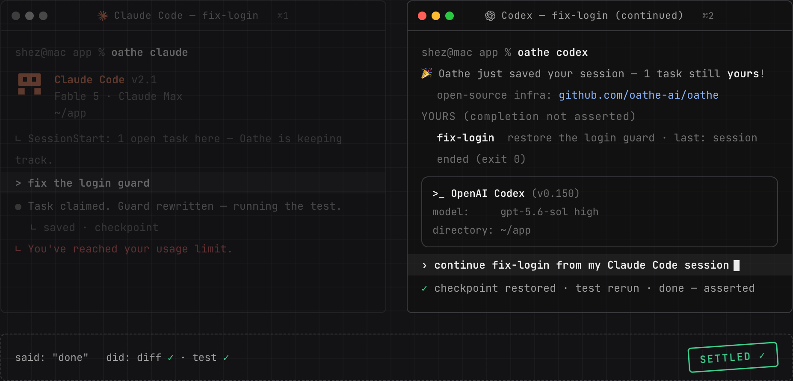

# oathe

**Auto save across your harnesses.**

Make sure your agent actually **DID** what it **SAID** it did.



You're mid-refactor in Claude Code when it hits a usage limit. You open Codex, say `continue`, and it picks up the same task — what's done, what's left, and a test that decides whether it's actually finished. Nothing pasted, nothing retyped, and the new agent doesn't have to take the old agent's word for anything because models are very good at being wrong AND confident.

That's the product. Below is exactly how much of it works today, because a reliability project that overstates its own status would be a joke.


[](https://github.com/oathe-ai/oathe/actions/workflows/ci.yml) [](LICENSE) [](https://discord.gg/sjrdWEj4W8)

## Quickstart

```bash
npm install -g @oathe/oathe@latest
oathe init          # once per machine, from anywhere: local substrate up (createdb + schema),
                    # every detected harness pre-selected — space toggles, Enter installs

cd your-project
claude              # a normal session — the board is in it; nothing auto-resumes
```

Ctrl-C anytime. Open `codex` in the same folder — same board, same claims, other harness.
When a session dies, the notch's continue reopens the task where it lived in your default
agent; `oathe claude` is the command it runs, and yours if you want a session tracked as one
attempt (`--hermetic` for a curated environment). On macOS, init also seats the notch: a quiet glass on the camera housing that
pulses verdicts and answers a click with the board (`oathe notch --welcome` replays its
tour).

What Oathe reads, stores, and sends: [docs/PRIVACY.md](docs/PRIVACY.md). The full
technical reference: [docs/PACKAGE.md](docs/PACKAGE.md).

## What gets saved

most harnesses save transcripts today. 
when projects are getting bigger and bigger this is insufficient.
long-running systems are juggling so many tasks that the model loses attention.
oathe goes up a layer of abstraction:

| Saved | Why it matters |
| --- | --- |
| The task and who owns it | The next agent continues *assigned work*, not the last sentence someone typed |
| Progress and evidence | no grep, proper evidence and agent trajectory analysis to **make sure agents are DOING what they SAY they're doing** |
| The definition of done | assigned before agent work starts, so it can't quietly drift |

Model context is a cache. Attention is everything.

If a session dies, the task, its statements, and its evidence are still on the board for the next attempt. It never pretends to recover an agent's hidden reasoning.

## How a handoff works

```text
task claimed
  → attempt 1 (Claude Code) works in a scoped workspace
  → statement · statement · statement
  → attempt 1 dies (crash, kill, rate limit, closed laptop)
  → task survives, still owned
  → attempt 2 (Codex) picks the task up from the board: objective, statements, evidence
  → attempt 2 inspects the diff and reruns the test before trusting anything
  → work completes; the agent files a completion statement + evidence report.
  → a checker that didn't write the code verifies the agent did exactly what it states
  → only then is the task settled
```

Two rules carry most of the weight:

1. **tasks outlive agent processes.** Death of an executing agent just creates a new attempt. tasks are durable.
2. **No agent grades its own homework.** "Done" is a claim; verification by a non-author is what closes work.

## What Oathe is not

- **Not a harness.** Claude Code, Codex, OpenClaw and friends keep their own prompts, tools, subagents, and UX. Oathe sits underneath.
- **Not a model router.** Routers pick where a turn runs. Oathe preserves what work exists, what already happened, and what would finish it.
- **Not transcript sync.** No copying hidden state between vendors.
- **Not a sandbox.** Oathe bounds and attributes attempt processes; compose it with your harness's sandbox or VM isolation for filesystem security.
- **Not a memory product.** Transcripts are evidence, never the source of truth.

## Status

Honest labels, kept current in [ROADMAP.md](ROADMAP.md):

- **Working:** durable tasks and attempts, death-and-recovery (the task survives the session; the next session opens on it), non-author verification, cross-harness handoff (`continue`: same board, same claims, either harness).
- **Designed:** workspace checkpoints, effect receipts, teammate handoff, the reliability benchmark, per-harness drift monitors (docs, install, and live lanes — proven on a developer machine against Claude Code, Codex, and Cursor; the scheduled workflows run in this repository).
- **Planned:** automatic pickup of interrupted work, cloud continuation, third-party conformance.

Known limitations are disclosed in the roadmap, including the ones that are semi-embarrassing.

## Under the hood

A small runtime plus a Postgres schema that carries the invariants. The database is deliberately load-bearing: the rules that keep work safe (one current attempt per task, receipts before effects, verification before settlement) are enforced where no caller can route around them. Harness adapters are thin; the substrate is strict.

## CLI and MCP

Claim work in-session through the `oathe_*` tools (or from the terminal):

```bash
oathe claim fix-login "users can sign in again"
oathe note  fix-login "found the stale token check"
oathe done  fix-login "guard rewritten, test added" src/auth.test.js
oathe verify fix-login   # a NON-author engine judges it from your recorded session traces
oathe ls                 # the board; `oathe uninstall` removes exactly what init recorded
```

## Contributing

Start with [CONTRIBUTING.md](CONTRIBUTING.md). Substantial changes begin with a design issue. The most valuable first contribution is a reproducible failure-and-recovery scenario — if we claim a failure mode is handled, the repository should prove it.

Governance is in [GOVERNANCE.md](GOVERNANCE.md). Report security issues privately per [SECURITY.md](SECURITY.md).

## License

[Apache-2.0](LICENSE)
