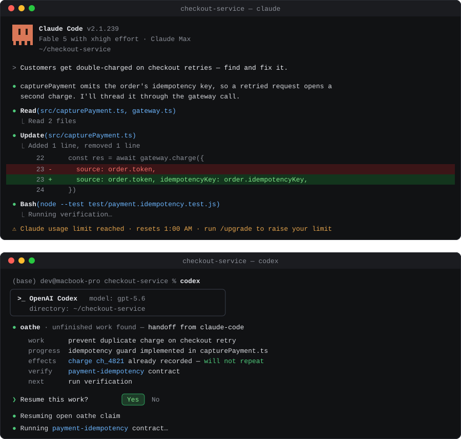

# oathe

**Auto save across your harnesses.**



You're mid-refactor in Claude Code when it hits a usage limit. You open Codex and it picks up the same task checkpointed, what's done, what's left, and a test that decides whether it's actually finished. Nothing pasted, nothing retyped, and the new agent doesn't have to take the old agent's word for anything because models are very good at being wrong AND confident.

That's the product. Below is exactly how much of it works today, because a reliability project that overstates its own status would be a joke.

[](https://github.com/oathe-ai/oathe/actions/workflows/ci.yml) [](LICENSE)

## What gets saved

most harnesses save transcripts today. 
when projects are getting bigger and bigger this is insufficient.
long-running systems are juggling so many tasks that the model loses attention.
oathe goes up a layer of abstraction:

| Saved | Why it matters |
| --- | --- |
| The task and who owns it | The next agent continues *assigned work*, not the last sentence someone typed |
| Progress and evidence | Finished parts don't get rediscovered by archaeology |
| Side-effect receipts | A payment, deploy, or message that already happened doesn't happen again on retry |
| The definition of done | assigned before agent work starts, so it can't quietly drift |
| A workspace checkpoint | Branch, commit, and work-in-progress bytes survive your session |

Model context is a cache. Attention is everything.

If a session dies, oathe compiles a context bundle for the next attempt from saved state. It never pretends to recover an agent's hidden reasoning.

## How a handoff works

```text
task claimed
  → attempt 1 (Claude Code) works in a scoped workspace
  → checkpoint · checkpoint · checkpoint
  → attempt 1 dies (crash, kill, rate limit, closed laptop)
  → task survives, still owned
  → attempt 2 (Codex) gets a compiled bundle + a checkpoint
  → attempt 2 inspects the diff and reruns the test before trusting anything
  → work completes; the agent files a completion statement + evidence report.
  → a checker that didn't write the code verifies the agent did exactly what it states
  → only then is the task settled
```

Two rules carry most of the weight:

1. **tasks outlive agent processes.** Death of an executing agent just creates a new attempt. tasks are durable.
2. **No agent grades its own homework.** "Done" is a claim; verification by a non-author is what closes work.

## What Oathe is not

- **Not a harness.** Claude Code, Codex, OpenClaw and friends keep their own prompts, tools, subagents, and UX. Oathe sits underneath.
- **Not a model router.** Routers pick where a turn runs. Oathe preserves what work exists, what already happened, and what would finish it.
- **Not transcript sync.** No copying hidden state between vendors.
- **Not a sandbox.** Oathe bounds and attributes attempt processes; compose it with your harness's sandbox or VM isolation for filesystem security.
- **Not a memory product.** Transcripts are evidence, never the source of truth.

## Status

Honest labels, kept current in [ROADMAP.md](ROADMAP.md):

- **Working:** durable tasks and attempts, death-and-recovery with a freshly compiled briefing, non-author verification, effect receipts (partial).
- **Designed:** workspace checkpoints, the Claude→Codex end-to-end path, teammate handoff, the reliability benchmark, per-harness drift monitors (docs, install, and live lanes — proven on a developer machine against Claude Code, Codex, and Cursor; the scheduled workflows go live with this repository).
- **Planned:** automatic pickup of interrupted work, cloud continuation, third-party conformance.

Known limitations are disclosed in the roadmap, including the ones that are semi-embarrassing.

<!-- QUICKSTART: fill from the actual pushed code — real install, real commands, real test run. Do not publish invented commands. -->

## Under the hood

A small runtime plus a Postgres schema that carries the invariants. The database is deliberately load-bearing: the rules that keep work safe (one current attempt per task, receipts before effects, verification before settlement) are enforced where no caller can route around them. Harness adapters are thin; the substrate is strict.

## Contributing

Start with [CONTRIBUTING.md](CONTRIBUTING.md). Substantial changes begin with a design issue. The most valuable first contribution is a reproducible failure-and-recovery scenario — if we claim a failure mode is handled, the repository should prove it.

Governance is in [GOVERNANCE.md](GOVERNANCE.md). Report security issues privately per [SECURITY.md](SECURITY.md).

## License

[Apache-2.0](LICENSE)
